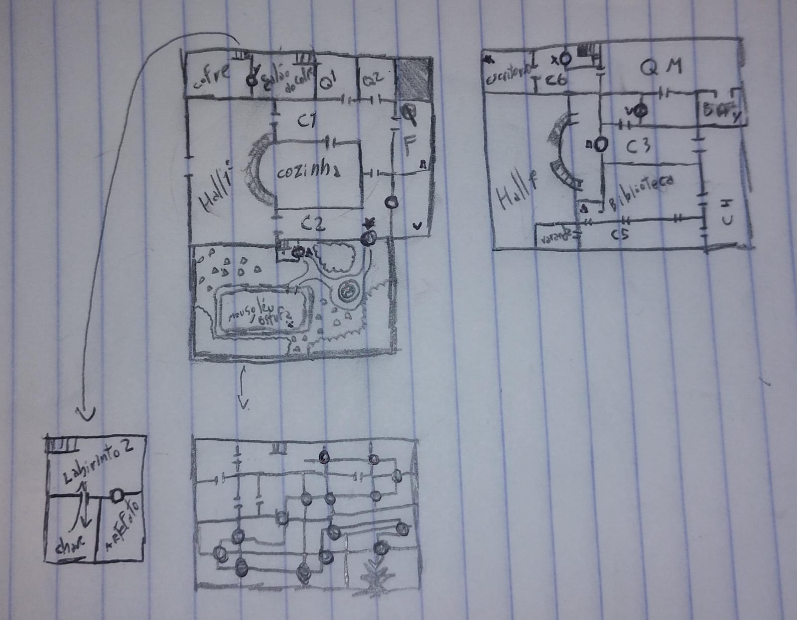

# Urban Hex

**Trabalho de Programação II - Text Adventure de Terror**

## Integrantes do Grupo

- M. Lucas de Souza Machado  
- Miguel Augusto Marques Nunes  
- Isabelle Pascini  
- Igor Correa  
- Jonathan Alexandre  
- Caio

## Enredo

Em *Urban Hex* você assume o papel de um explorador urbano que recebe um convite misterioso para visitar uma mansão abandonada nos limites da cidade. Ao entrar, os portões se fecham atrás de você e a única forma de escapar é encontrar todas as chaves espalhadas pelo prédio. Logo você perceberá que não está tão sozinho na mansão quanto imaginava.

Explore a mansão procurando as chaves necessárias para a sua fuga enquanto foge da entidade que persegue você a cada novo cômodo visitado.

## Mapa Atual

Abaixo está um esboço do mapa do jogo contendo dois dos três andares e 18 cômodos para explorar durante a jogatina.

---

## O Monstro

decidimos por ser uma criatura lovecraftiana na base da roleta russa.
